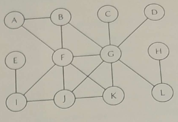
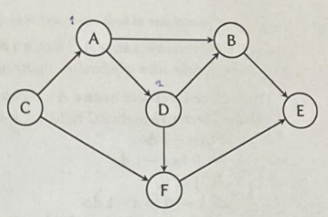

## 1

*Správná odpověď macimálně 13 bodů, nesmyslná -4 body*

### Zadání

Proveďte analýzu třídícího algoritmu BubbleSort daného následujícím pseudokódem.

$\textbf{Vstup\hspace{0.3cm}: }$ Dvě čtvercové matice $\textit{A}$ a $\textit{B}$ řádu $n$  
$\textbf{Výstup\hspace{0.075cm}: }$ Čtvercová matice $\textit{C}$ řádu $n$, kde $\textit{C} = \textit{AB}$  

1 $\textbf{for}$ $\textit{i}$ $\gets$ 0 $\textbf{to}$ $\textit{n} - 1$  $\textbf{do}$  
2 $\hspace{0.5cm}\textbf{for}$ $\textit{j}$ $\gets$ $0$ $\textbf{to}$ $\textit{n} - 1$  $\textbf{do}$  
3 $\hspace{1.0cm}\textit{C}[i,j] \gets 0$;  
4 $\hspace{1.0cm}\textbf{for}$ $\textit{j}$ $\gets$ $0$ $\textbf{to}$ $\textit{n} - 1$  $\textbf{do}$  
5 $\hspace{1.5cm}$ $\textit{C}[i,j]$ $\gets$ $\textit{C}[i,j] + \textit{A}[i,k] * \textit{B}[k,j]$;  
6 $\hspace{1.0cm}\textbf{end}$ 
7 $\hspace{0.5cm}\textbf{end}$ 
8 $\textbf{end}$ 
9 $\textbf{return}$ $\textit{C}$; 

Vaším úkolem provést analýzu algoritmu. Očekávají se odpovědi na následující otázky:  
(a) *(1 bod)* Volba parametru reprezentujícího velikost vstupu.  
(b) *(1 bod)* Nalezení základních operací algoritmu.  
(c) *(3 body)* Je nutné u daného algoritmu rozlišovat nejhorší, průměrný a nejlepší případ? Nebo tyto případy splývají? Na čem závisí rozhodnutí? Poznámka: Pokud by bylo nutné zkoumat více případů,bude stačit, když vypracujete řešení pro nejhorší případ.  
(d) *(3 body)* Sestavení rovnic, vyjadřujících počet základních operací vykonaných algoritmem v závislostina velikosti vstupu.  
(e) *(3 body)* Zjednodušení rovnic sestavených v předcházejícím bodě.  
(f) *(2 body)* Stanovení řádového růstu složitosti algoritmu.

### Řešení

(a) <u>**n**</u> (počet řádků u čtvercových matic je stejný jako počet sloupců)  
(b) Základní operace jsou:
- ‎<u>**Inicializace matice $C$ na hodnotu 0, pro každý prvek jedna operace**</u> (Iterace pomocí i,j)
- ‎<u>**Násobení matic $A$ a $B$ a přičtení hodnoty $C$ pro daný prvek**</u> (Přes iteraci k)
[//]: # (End list)
(c) <u>**V tomto případě není nutné rozlišovat, protože procházíme vždy všechny okolní prvky pole. Jeho složitost tudíž závisí na velikosti vstupu.**</u>  
(d) 

$$
\displaystyle M(n) = \sum^{n-1}_{i=0}\sum^{n-1}_{j=0}\sum^{n-1}_{k=0}1
$$

(e)

$$
\begin{align*}
\displaystyle M(n) &= \sum^{n-1}_{i=0}\sum^{n-1}_{j=0}\sum^{n-1}_{k=0}1\\
&= \sum^{n-1}_{i=0}\sum^{n-1}_{j=0}n\\
&= \sum^{n-1}_{i=0}n^2\\
&= n^3
\end{align*}
$$
(f) $O(n^3)$  

## 2

*Správná odpověď maximálně 5 bodů, nesmyslná -1 bod*

### Zadání

Je dána následující posloupnost písmen: JDPHTRBXNLFV. Písmena z této posloupnosti byla postupně, v pořadí jak jsou zapsána, vložena do binárního vyhledávacího stromu. Nakreslete výsledný strom. Jen pro připomenutí, abeceda vypadá takto: ABCDEFGHIJKLMNOPQRSTUVWXYZ.

### Řešení

$$
\begin{array}{cccccccccccccccccccccccccccccc}
&&&&&&&&&&&&&& \text{J} &&&&&&&&&&&&&& \\
&&&&&&&&&&&& \swarrow &&&& \searrow &&&&&&&&&&&& \\
&&&&&&&&&&& \text{D} &&&&&&& \text{P} &&&&&&&& \\
&&&&&&&&&& \swarrow && \searrow &&&& \swarrow &&& \searrow &&&&&&& \\
&&&&&&&&& \text{B} &&&& \text{H} && \text{N} &&&&& \text{T} &&&&&&&& \\
&&&&&&&&&&&& \swarrow && \swarrow &&&&& \swarrow && \searrow &&&&&&& \\
&&&&&&&&&&& \text{F} && \text{L} &&&&& \text{R} &&&& \text{X} &&& \\
&&&&&&&&&&&&&&&&&&&&& \swarrow &&&& \\
&&&&&&&&&&&&&&&&&&&& \text{V} &&&&&
\end{array}

$$

## 3

*Správná odpověď maximálně 5 bodů, nesmyslná -2 body*

### Zadání

Máte dánu funkci $f(n) = 12n^4 - 3n^3 + n^2 - 7n - 8$. Formálně matematicky dokažte, zda platí $f(n)\in \Omega(n^3)$ nebo $f(n)\notin \Omega(n^3)$

### Řešení

$$
\begin{align*}
\displaystyle
\lim_{n\to\infin}\dfrac{12n^4-3n^3+n^2-7n-8}{n^3} &= \lim_{n\to\infin}\dfrac{\not{n^3}(12n^{^{\nearrow^{\normalsize^{\infin}}}}-3^{^{\nearrow^{\normalsize^{c}}}}+\dfrac{1}{n}^{^{\nearrow^{\normalsize^{0}}}}-\dfrac{7}{n^2}^{^{\nearrow^{\normalsize^{0}}}}-\dfrac{8}{n^3}^{^{\nearrow^{\normalsize^{0}}}})}{\not{n^3}} \\
&= \underline{\infin}
\end{align*}
$$

,takže $\underline{\underline{f(n)\in \Omega(n^3)}}$

## 4

*Správná odpověď maximálně 5 bodů, nesmyslná -1 bod*

### Zadání

Máte dán neorientovaný graf, viz obrázek vpravo. Na tento graf aplikujte algoritmus průchodu grafem do šířky. Počáteční vrchol pro průchod grafem je vrchol **F**. Zapište vrcholy grafu v tom pořadí, jakém je algoritmus průchodu grafem do šířky postupně navštívil (prošel, zpracoval,...). *Poznámka*: Sousední vrcholy k danému vrcholu předávejte k dalšímu zpracování vždy v abecedním pořadí. Předpokládejme například, že algoritmus právě zpracovává vrchol M. A dále předpokládejme, že s tímto vrcholem sousedí vrcholy Q, W a R. Sousední vrcholy předáme k dalšímu zpracování v pořadí Q, R a W.

### Řešení

BFS = <u>**FABGJICDLEH**</u>

## 5

*Správná odpověď maximálně 3 body, nesmyslná -1 bod*

### Zadání

Máme dán orientovaný acyklický graf, viz obrázek vpravo. Na tento graf aplikujte algoritmus topologiského třídění. Zapište vrcholy grafu seřazené algoritmem topologického třídění.

### Řešení

Postup: vrcholy, do kterých nevedou cesty $\Rightarrow$ <u>**CADFBE**</u>

## 6

*Správná odpověď maximálně 9 bodů, nesmyslná -3 body*

### Zadání

Jednou z klasických úloh v informatice je *Problém obchodního cestujícího* (Traveling Salesman Problem). Vaším úkolem je:  

(a) *(3 body)* nejprve definovat problém samotný, dále  
(b) *(3 body)* vysvětlete řešení tohoto problému pomocí strategie řešení hrubou silou (brute force strategy), a nakonec  
(c) *(3 body)* odhadněte časovou složitost řešení.  

*Poznámka*: V odpovědi se můžete omezit na dvourozměrný prostor.

### Řešení

(a) Kombinaristický problém, kde je cílem najít nejkratsí cestu pro obchodního cestujícího, který musí navštívit určený počet míst a vrátit se zpět di výchozího bodu. Cílem je tedy minimalizovat délku cesty, přičemž musí navštívit všechna uřčená místa jen jednou.  
(b) Pomocí *Brute force* se řeší tak, že vyzkouší systematicky všchny kombinace měst, které začínají a končí ve stejném městě. Následně vybere cestu s nejkratší délkou, která představuje optimální řešení.  
(c) Časová složitost je $O(n!)$, kde $n$ je počet měst, exponenciálně roste čas s rostoucím počtem měst.
