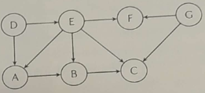

## 1

*Správná odpověď macimálně 13 bodů, nesmyslná -4 body*

### Zadání

Proveďte analýzu třídícího algoritmu BubbleSort daného následujícím pseudokódem.

$\textbf{Vstup\hspace{0.3cm}: }$ Pole $\textit{A}[0..\textit{n} - 1]$  
$\textbf{Výstup\hspace{0.075cm}: }$ Vrací true, pokud jsou všechny prvky unikátní, jinak vrací false  

1 $\textbf{for}$ $\textit{i}$ $\gets$ 0 $\textbf{to}$ $\textit{n} - 2$  $\textbf{do}$  
2 $\hspace{0.5cm}\textbf{for}$ $\textit{j}$ $\gets$ $i + 1$ $\textbf{to}$ $\textit{n} - 1$  $\textbf{do}$  
3 $\hspace{1.0cm}\textbf{if}$ $\textit{A}[i] = \textit{A}[j]$  $\textbf{then}$  
4 $\hspace{1.5cm}$ $\textbf{return}$ $\textit{false}$;  
5 $\hspace{1.0cm}\textbf{end}$ 
6 $\hspace{0.5cm}\textbf{end}$ 
7 $\textbf{end}$ 
8 $\textbf{return}$ $\textit{true}$ 

Vaším úkolem provést analýzu algoritmu. Očekávají se odpovědi na následující otázky:  
(a) *(1 bod)* Volba parametru reprezentujícího velikost vstupu.  
(b) *(1 bod)* Nalezení základních operací algoritmu.  
(c) *(3 body)* Je nutné u daného algoritmu rozlišovat nejhorší, průměrný a nejlepší případ? Nebo tyto případy splývají? Na čem závisí rozhodnutí? Poznámka: Pokud by bylo nutné zkoumat více případů,bude stačit, když vypracujete řešení pro nejhorší případ.  
(d) *(3 body)* Sestavení rovnic, vyjadřujících počet základních operací vykonaných algoritmem v závislostina velikosti vstupu.  
(e) *(3 body)* Zjednodušení rovnic sestavených v předcházejícím bodě.  
(f) *(2 body)* Stanovení řádového růstu složitosti algoritmu.

### Řešení

(a) <u>**n**</u> (počet prvnů v poli A)  
(b) <u>**porovnání dvou prvků**$A[i] = A[j]$</u>  
(c) <u>**V tomto případě není nutné rozlišovat, protože procházíme vždy všechny okolní prvky pole. Jeho složitost tudíž závisí na velikosti vstupu.**</u>  
(d) 
$$
\begin{align*}
\displaystyle\sum^{n-2}_{i=0}\sum^{n-1}_{j=i+1} &= \sum^{n-2}_{i=0}[(n-1)-(i+1)+1]\\
&= \sum^{n-2}_{i=0}n-1-i-1+1\\
&= \sum^{n-2}_{i=0}n-1-i\\
&= \sum^{n-2}_{i=0}(n-1) - \sum^{n-2}_{i=0}i \\
&= (n - 1) - \sum^{n-2}_{i=0}i - \dfrac{(n-2)(n-1)}{2}\\
&= {(n-1)}^2-\dfrac{(n-2)(n-1)}{2}\\
&= \dfrac{(n-1)n}{2}
\end{align*}
$$
(e) $\dfrac{1}{2}n$  
(f) $O(n^2)$  

## 2

*Správná odpověď maximálně 5 bodů, nesmyslná -1 bod*

### Zadání

Je dána následující posloupnost písmen: LHRVNXJDTFBP. Písmena z této posloupnosti byla postupně, v pořadí jak jsou zapsána, vložena do binárního vyhledávacího stromu. Nakreslete výsledný strom. Jen pro připomenutí, abeceda vypadá takto: ABCDEFGHIJKLMNOPQRSTUVWXYZ.

### Řešení

$$
\begin{array}{cccccccccccccccccccccccccccccc}
&&&&&&&&&&&&&& \text{L} &&&&&&&&&&&&&& \\
&&&&&&&&&&&& \swarrow &&&& \searrow &&&&&&&&&&&& \\
&&&&&&&&&&& \text{H} &&&&&&& \text{R} &&&&&&&& \\
&&&&&&&&&& \swarrow && \searrow &&&& \swarrow &&&& \searrow &&&&&& \\
&&&&&&&&& \text{D} &&&& \text{J} && \text{N} &&&&&& \text{V} &&&&&&& \\
&&&&&&&& \swarrow && \searrow &&&&&& \searrow &&&& \swarrow && \searrow &&&&&& \\
&&&&&&& \text{B} &&&& \text{F} &&&&&& \text{P} && \text{T} &&&& X &&
\end{array}

$$

## 3

*Správná odpověď maximálně 5 bodů, nesmyslná -2 body*

### Zadání

Máte dánu funkci $f(n) = 3n^4 - 8n^3 - 5n^2 - 5n - 11$. Formálně matematicky dokažte, zda platí $f(n)\in O(n^3)$ nebo $f(n)\notin O(n^3)$

### Řešení

$$
\begin{align*}
\displaystyle
\lim_{n\to\infin}\dfrac{3n^4-8n^3-5n^2-5n-11}{n^3} &= \lim_{n\to\infin}\dfrac{\not{n^3}(3n^{^{\nearrow^{\normalsize^{\infin}}}}-8^{^{\nearrow^{\normalsize^{c}}}}-\dfrac{5}{n}^{^{\nearrow^{\normalsize^{0}}}}-\dfrac{5}{n^2}^{^{\nearrow^{\normalsize^{0}}}}-\dfrac{11}{n^3}^{^{\nearrow^{\normalsize^{0}}}})}{\not{n^3}} \\
&= \underline{\infin}
\end{align*}
$$

,takže $\underline{\underline{f(n)\not\in O(n^3)}}$

## 4

*Správná odpověď maximálně 5 bodů, nesmyslná -1 bod*

### Zadání

Máte dán neorientovaný graf, viz obrázek vpravo. Na tento graf aplikujte algoritmus průchodu grafem do šířky. Počáteční vrchol pro průchod grafem je vrchol **K**. Zapište vrcholy grafu v tom pořadí, jakém je algoritmus průchodu grafem do šířky postupně navštívil (prošel, zpracoval,...). *Poznámka*: Sousední vrcholy k danému vrcholu předávejte k dalšímu zpracování vždy v abecedním pořadí. Předpokládejme například, že algoritmus právě zpracovává vrchol M. A dále předpokládejme, že s tímto vrcholem sousedí vrcholy Q, W a R. Sousední vrcholy předáme k dalšímu zpracování v pořadí Q, R a W.

### Řešení

BFS = <u>**KFGJABICDLEH**</u>

## 5

*Správná odpověď maximálně 3 body, nesmyslná -1 bod*

### Zadání

Máme dán orientovaný acyklický graf, viz obrázek vpravo. Na tento graf aplikujte algoritmus topologiského třídění. Zapište vrcholy grafu seřazené algoritmem topologického třídění.

### Řešení

Postup: vrcholy, do kterých nevedou cesty $\Rightarrow$ <u>**DGEFABC**</u>

## 6

*Správná odpověď maximálně 9 bodů, nesmyslná -3 body*

### Zadání

Jednou z klasických úloh v informatice je *Problém batohu* (Knapsack Problem). Vaším úkolem je:  

(a) *(3 body)* nejprve definovat problém samotný, dále  
(b) *(3 body)* vysvětlete řešení tohoto problému pomocí strategie řešení hrubou silou (brute force strategy), a nakonec  
(c) *(3 body)* odhadněte časovou složitost řešení.  

*Poznámka*: V odpovědi se můžete omezit na dvourozměrný prostor.

### Řešení

(a) Problém batohu, je optimalizační problém, kde je dán batoh s omezenou kapacitou a soubor předmětů, přičemž každý předmět má svou váhu a hodnotu. Cílem je vybrat takovou kombinaci předmětů, která maximalizuje celkovou hodnotu při splnění omezení nosnosti.  
(b) Algoritmus u *Brute force* postupuje rekurzivně a pro každý předmět má 2 možnosti: buď přidá, nebo ne. Algoritmus projde všechny předměty a vybere optimální kombinaci.  
(c) Pomocí *Brute force* je exponenciální, tedy $O(n^2)$.
