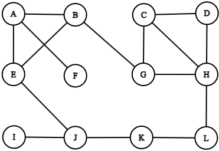
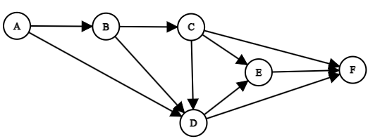

## 1

*Správná odpověď macimálně 13 bodů, nesmyslná -4 body*

### Zadání

Proveďte analýzu třídícího algoritmu BubbleSort daného následujícím pseudokódem.

$\textbf{Vstup\hspace{0.3cm}: }$ Pole $\textit{A}[0..\textit{n} - 1]$ s definovaným uspořádáním na prvcích pole  
$\textbf{Výstup\hspace{0.075cm}: }$ Setříděné pole $\textit{A}$  

1 $\textbf{for}$ $\textit{i}$ $\gets$ 0 $\textbf{to}$ $\textit{n} - 2$  $\textbf{do}$  
2 $\hspace{0.5cm}\textbf{for}$ $\textit{j}$ $\gets$ 0 $\textbf{to}$ $\textit{n} - \textit{i} - 2$  $\textbf{do}$  
3 $\hspace{1.0cm}\textbf{if}$ $\textit{A}[j] > \textit{A}[j + 1]$  $\textbf{then}$  
4 $\hspace{1.5cm}$ Swap ($\textit{A}[j],\textit{A}[j + 1]$);  
5 $\hspace{1.0cm}\textbf{end}$ 
6 $\hspace{0.5cm}\textbf{end}$ 
7 $\textbf{end}$ 

Vaším úkolem provést analýzu algoritmu. Očekávají se odpovědi na následující otázky:  
(a) *(1 bod)* Volba parametru reprezentujícího velikost vstupu.  
(b) *(1 bod)* Nalezení základních operací algoritmu.  
(c) *(3 body)* Je nutné u daného algoritmu rozlišovat nejhorší, průměrný a nejlepší případ? Nebo tyto případy splývají? Na čem závisí rozhodnutí? Poznámka: Pokud by bylo nutné zkoumat více případů,bude stačit, když vypracujete řešení pro nejhorší případ.  
(d) *(3 body)* Sestavení rovnic, vyjadřujících počet základních operací vykonaných algoritmem v závislostina velikosti vstupu.  
(e) *(3 body)* Zjednodušení rovnic sestavených v předcházejícím bodě.  
(f) *(2 body)* Stanovení řádového růstu složitosti algoritmu (na základě odpovědi na předchozí otázku).

### Řešení

TBD

## 2

*Správná odpověď maximálně 5 bodů, nesmyslná -1 bod*

### Zadání

Je dána následující posloupnost písmen: LTFBPVDNXHJR. Písmena z této posloupnosti byla postupně, v pořadí jak jsou zapsána, vložena do binárního vyhledávacího stromu. Nakreslete výsledný strom. Jen pro připomenutí, abeceda vypadá takto: ABCDEFGHIJKLMNOPQRSTUVWXYZ.

### Řešení

TBD

## 3

*Správná odpověď maximálně 5 bodů, nesmyslná -2 body*

### Zadání

Máte dánu funkci $f(n) = 11n^4 - 4n^3 + 7n^2 + 7n - 8$. Formálně matematicky dokažte, zda platí $f(n)\in\Theta(n^2)$ nebo $f(n)\notin\Theta(n^2)$

### Řešení

TBD

## 4

*Správná odpověď maximálně 5 bodů, nesmyslná -1 bod*

### Zadání

Máte dán neorientovaný graf, viz obrázek vpravo. Na tento graf aplikujte algoritmus průchodu grafem do šířky. Počáteční vrchol pro průchod grafem je vrchol **H**. Zapište vrcholy grafu v tom pořadí, jakém je algoritmus průchodu grafem do šířky postupně navštívil (prošel, zpracoval,...). *Poznámka*: Sousední vrcholy k danému vrcholu předávejte k dalšímu zpracování vždy v abecedním pořadí. Předpokládejme například, že algoritmus právě zpracovává vrchol M. A dále předpokládejme, že s tímto vrcholem sousedí vrcholy Q, W a R. Sousední vrcholy předáme k dalšímu zpracování v pořadí Q, R a W.

### Řešení

TBD

## 5

*Správná odpověď maximálně 3 body, nesmyslná -1 bod*

### Zadání

Máme dán orientovaný acyklický graf, viz obrázek vpravo. Na tento graf aplikujte algoritmus topologiského třídění. Zapište vrcholy grafu seřazené algoritmem topologického třídění.

### Řešení

TBD

## 6

*Správná odpověď maximálně 9 bodů, nesmyslná -3 body*

### Zadání

Jednou z klasických úloh v informatice je *Konvexní obal množiny bodů* (Convex Hull Problem). Vaším úkolem je:  

(a) *(3 body)* nejprve definovat problém samotný, dále  
(b) *(3 body)* vysvětlete řešení tohoto problému pomocí strategie řešení hrubou silou (brute force strategy), a nakonec  
(c) *(3 body)* odhadněte časovou složitost řešení.  

*Poznámka*: V odpovědi se můžete omezit na dvourozměrný prostor.

### Řešení

TBD
