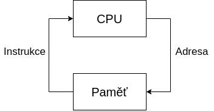
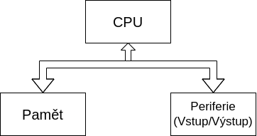
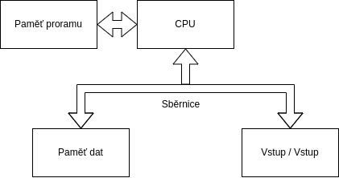

### Jaké jsou základní principy fungování počítače?
- Počítač je programován obsahem paměti
- Instrukce se vykonávají sekvenčně
- Každý následující krok závisí na tom předchozím

- Procesor si přes sběrnici vyžádá instrukci z paměti na adrese IP
- Poté co instrukci získá ji provede
- Zvýší IP/PC 
- Cyklus čtení a provedení se opakuje

### Kritéria a Principy dle von Neumanna:
- Počítač je řízen obsahem paměti (struktura počítače je nezávislá na typu úlohy)
- Strojové instrukce a Data jsou v jedné paměti (lze přistupovat jednotným způsobem)
- Paměť je rozdělena do buněk stejné velikosti (Jejich pořadové číslo je jejich adresa)
- Následující krok je závislý na tom přechozím
- Program je sekvence instrukcí, ty jsou vykonávány sekvenčně, v pořadí v jakém jsou zapsány do paměti
- Změna pořadí instrukcí je možná pomocí skoku
- Pro reprezentaci čísel, adres, znaků.. se používá dvojková soustava

### Jaké má výhody a nevýhody architektura dle von Neumanna?
- Výhody
    - Rozdělení paměti pro kod a data určuje programátor
    - do paměti se přistupuje stejným způsobem pro data i instrukce
    - jedna sběrnice $\Rarr$ jednodušší výroba
- Nevýhody
    - jedna paměť může mít při chybě za následek přepsání vlastního programu
    - jediná sběrnice je úzké místo

### Přinesla harvardská architektura nějaká vylepšení proti von Neumannově?
- Výhody
    - Oddělení paměti dat a programu
    - Program už nemůže přepsat sám sebe
    - Paměti můžou být vyrobeny různými technologiemi
    - Dvě sběrnice umožňují přistupovat k instrukcím a datům zárověň
- Nevýhody:
    - dvě sběrnice jsou dražší
    - nevyužitou část paměti dat nelze použít pro program.. a naopak

### Jaká je podpora paralelismu u obou architektur počítačů?
- Žádná .. instrukce jsou vykonávány sekvenčně, následující krok je závislý na tom předchozím
- Paralelizmy se musí simulovat až na úrovni OS

### Je lepší mít oddělené paměti pro data i programa proč?
- Ano
    - Program nemůže přepsat sám sebe
- Ne 
    - Jedna sběrnice $\Rarr$ jednodušší výroba
    - Rozdělení pro kód a data určuje programátor 
    - Lze efektivněji využít kapacitu paměti

### Může fungovat počítač bez paměti či bez periferií?
- NE... jak pravil von Neumann .. je potřeba procesoru, paměti a periferií

### K čemu se v počítači využívá dvojková soustava?
- Pro reprezentaci čísel, adres, znaků..

### Zvyšují sběrnice výkon počítače?
- Ne přímo, ale mohou jej omezit

### Je možné, aby procesor prováděl instrukce jinak, než sekvenčně?
- NE instrukce se provádějí sekvenčně 

### Jak je v počítači organizovaná paměť?
- Je složená z za sebou jdoucích buňěk stejné velikosti (obvykle 8bit), jejich pořadové číslo se využívá jako jejich adresa 
