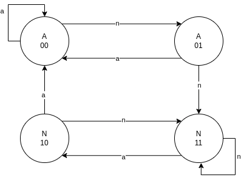

### Kdy a proč se začaly procesory dělit na RISC a CISC?
- V 70. letech, kvůli narůstající složitosti procesorů...

### Jaké byly zásadní důvody, proč se začaly procesory RISC vyvíjet?
- Výzkumy ukázaly, že programátoři a compilátory používají instrukce velmi nerovnoměrně  (v 50% případů se vyskytují pouze 3 instrukce)
- Snahy o nalezení optimálního instrukčního souboru $\Rarr$ vznik RISC

### Jaké jsou základní konstrukční vlastnosti procesorů RISC?
- Malý instrukční soubor
- V každém strojovém cyklu by měla být dokončena jedna instrukce
- Zřeťezené zpracování instrukcí 
- Data jsou z hlavní paměti vybírána a úkládána výhradně pomocí LOAD a STORE instrukcí
- Instrukce mají pevnou délku a jednotný formát
- Je použit vyšší počet registrů
- Složitost se přesouvá na optimalizující kompilátory

### Jak přispěly jednotlivé charakteristické vlastnosti procesorů RISC ke zvýšení výpočetního výkonu?
- Jednotná délka instrukcí $\Rarr$ rychlejší výběr instrukcí z paměti $\Rarr$ lepší plnění fronty instrukcí 
- Jednotný formát $\Rarr$ zjednodušuje dekódování
- Zřetězené zpracování instrukcí 

### Jaký je princip zřetězeného zpracování instrukcí v RISC procesorech?
- Provedení instrukce musí vždy projít stejnými fázemi (né nutně těma co jsou na obrázku)
- Funguje jako "výrobní linka" 

CISC:

|    | T1 | T2 | T3 | T4 | T5 | T6 | T7 | T8 | T9 | T10 | T11 | T12 |
|----|----|----|----|----|----|----|----|----|----|-----|-----|-----|
| VI | I1 |    |    |    |    |    | I2 |    |    |     |     |     |
| DE |    | I1 |    |    |    |    |    | I2 |    |     |     |     |
| VA |    |    | I1 |    |    |    |    |    | I2 |     |     |     |
| VO |    |    |    | I1 |    |    |    |    |    | I2  |     |     |
| PI |    |    |    |    | I1 |    |    |    |    |     | I2  |     |
| UV |    |    |    |    |    | I1 |    |    |    |     |     | I2  |

RISC:

|    | T1 | T2 | T3 | T4 | T5 | T6 | T7 | T8 | T9 | T10 | T11 | T12 |
|----|----|----|----|----|----|----|----|----|----|-----|-----|-----|
| VI | I1 | I2 | I3 | I4 | I5 | I6 | I7 |    |    |     |     |     |
| DE |    | I1 | I2 | I3 | I4 | I5 | I6 | I7 |    |     |     |     |
| VA |    |    | I1 | I2 | I3 | I4 | I5 | I6 | I7 |     |     |     |
| VO |    |    |    | I1 | I2 | I3 | I4 | I5 | I6 | I7  |     |     |
| PI |    |    |    |    | I1 | I2 | I3 | I4 | I5 | I6  | I7  |     |
| UV |    |    |    |    |    | I1 | I2 | I3 | I4 | I5  | I6  | I7  |

Legend:

| short name | full name           |
|------------|---------------------|
| VI         | Výběr Instrukce     |
| DE         | Dekodování          |
| VA         | Výpočet Adresy      |
| VO         | Výběr Operandu      |
| PI         | Provedení Instrukce |
| UV         | Uložení Výsledku    |

### Jakého zrychlení lze zřetězeným zpracováním instrukcí dosáhnout?
- V ideáním světě, při délce zřetězení 6-ti instrukcí, udělá během 12 cyklů
    - CISC: 2 instrukce
    - RISC: 7 instrukcí 
- viz. [tabulky](#jaký-je-princip-zřetězeného-zpracování-instrukcí-v-risc-procesorech)

### Jaké problémy přináší zřetězené zpracování instrukcí v procesorech RISC?
- Datové a strukturální hazardy 
    - Datové: Když instrukce potřebuje mít k dispozici data předchozí instrukce ( a ta ještě nejsou k dispozici)
    - Strukturální: Problém omezených prostředků procesoru (a počítače jako celku) ... např. jen jedna sběrnice
- Problémy plněním fronty instrukcí
    - Podmíněné skoky
    - Nepodmíněné skoky na adresu, která se musí vypočítat

    
### Co to je predikce skoků, proč se používá a jaké způsoby predikce se využívají?
- Statická 
    - Do instrukce se vkládají příslušné bity již při kompilaci (nebo programátorem při psaní programu)
- Dynamická
    - Během běhu programu se zaznamenává, jestli se skok provedl, nebo ne
- Může být:
    - Jedno bitová
    - Dvou bitová

### Co to jsou datové a strukturální hazardy v RISC procesorech? Co je způsobuje?
- [uvedeno výše...](#jaké-problémy-přináší-zřetězené-zpracování-instrukcí-v-procesorech-risc)

### Jak funguje dvoubitová dynamická predikce skoků a proč se využívá?
- Jako čtyř stavový automat

- `A` predikuje provedení skoku, `N` říká, že se skok provádět nebude
- `a` a `n` přechody označují, zda se skok naposledy prováděl

