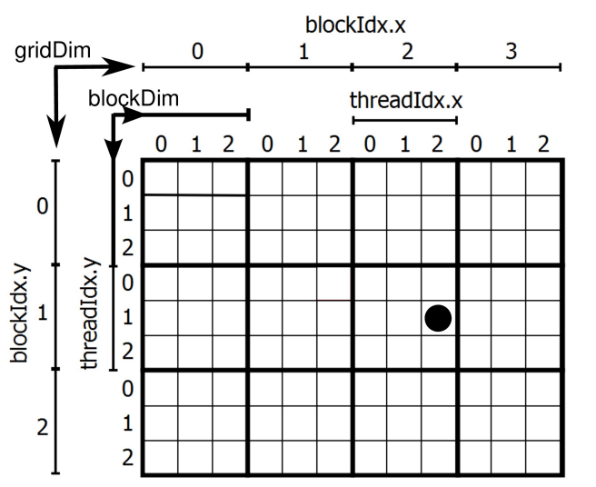
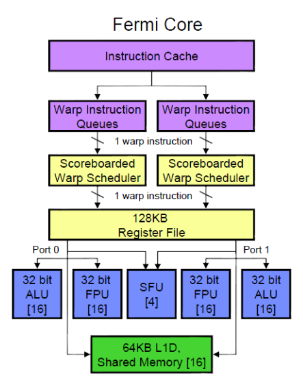

- Rozšírení jazyka C/C++
- Funguje jen na Nvidia kartách
- Warp je skupina jader, která je ovládána schedulerem
    - Každý warp má svůj dekoder instrukcí a scheduler
    - Každé jádro má FP unit a INT unit

### Výhody GPU/cudy?
- Masivní Paralelizace
- GPU je navržena pro zpracování výpočetně náročného kódu s omezeným počtem podmíněných skoků (Nejlépe bez IFů)


### Čím se musí řídit programátor při práci s CUDA ?
- Jádra musí bý na sobě nezávislá (GPU negarantuje pořadí exekuce threadu)
- Musí určit správný počet bloků a vláken 
- Nepoužívat IFy (a cykly)
- TODOOOO: Unified Memory ???


### Organizace mřížky ?



- Kód kernelu musí bt přizpůsoben mřížce
- Pro určení pozice threadu v mřížce lze použít předdefinované proměnné (blockIdx, ..)
    - `x = blockIdx.x * blockDim.x + threadIdx.x;`
    - `y = blockIdx.y * blockDim.y + threadIdx.y;`


### Jaký je postup ?
- (alokuje se místo na GPU)
- překopírují se data z hostu do device
- zapnou se thready v GPU multiprocesoru
- vykonají se thready v GPU multiprocesoru
- překopírují se data z GPU zpátky do host


### Rozšíření jazyka C/C++ ?
- Modifikátory funkcí:
    - `__device__` - Pouze GPU (Vykonána na GPU, zavolána z GPU)
    - `__global__` - Pro oboje (Vykonána na grafické kartě, ale zavolána z procesoru)
    - `__host__` - Pouze pro procesor
- Kvantifikátory (qualifier) proměnných (nikdy jsme je irl nepoužili):
    - `__device__`
    - `__constant__`
    - `__shared__`
- Datové typy s příponou 1,2,3,4 .. např `int3`
    - char
    - uchar
    - int
    - uint
    - short
    - ushort
    - long
    - ulong
    - float
    - double (double1, double2)   (off-topic fact.. float a double unsigned neexistují)
- dim3 je uint3
- ```jmeno_funkce<<<pocet_bloku, pocet_vlaken>>>(parametry)```


