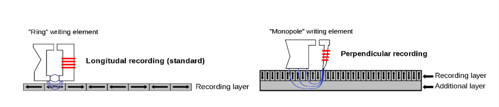
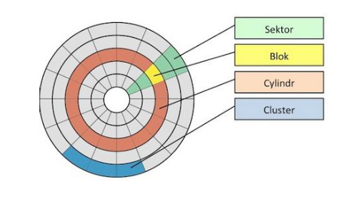
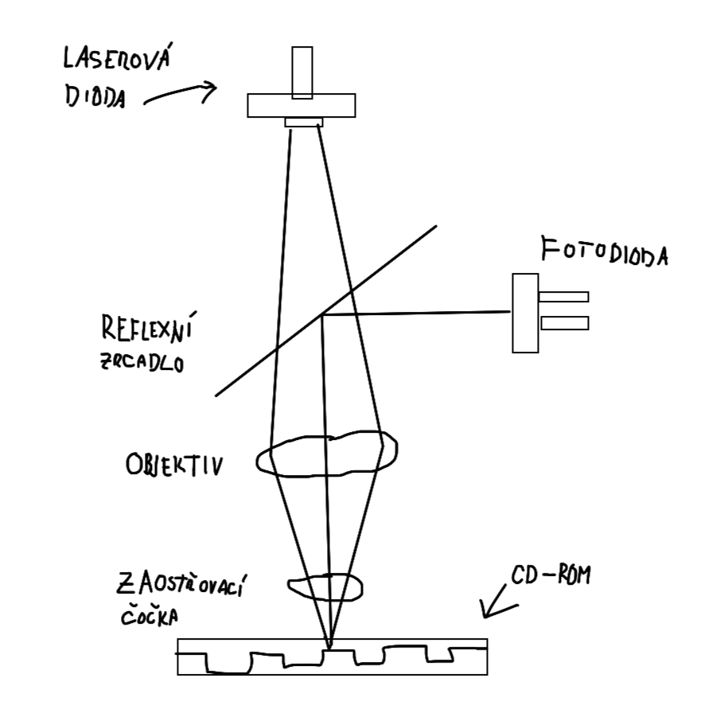

### Typy pamětí (externích) ?
- Magnetické paměti
    - Pevný disk
    - Disketová mechanika
- Optické Paměti
    - CD
    - DVD
- Magnetooptické paměti

### Jaký je princip ukládání dat u magnetických pamětí ?
- Záznamové médium má tvar kruhové desky (disk,disketa), nebo dlouhé pásky
- Je pokryto magnetockou vrstvou a pohybuje se konstantní rychlostí
- V bodu dotyku s povrchem je štěrbina magnetického obvodu (štěrbina je díra v té hlavě(Magnetickém obvodu)).. štěrbina + mag. obvod tvoří jádro
- Pokud manetickým obvodem prochází proud, vzniká magnetický tok, který se díky štěrbině dostává do okolí, a ovlivňuje magnetickou vrstvu 

- Podélný zápis:
    - Menší hustota
- Kolmý zápis:
    - 10x větší kapacita
    - Větší technická náročnost

### Jak funguje pevný disk ?

- Proud je převeden na indukci
- Disk je vyroben z nemagnetického materiálu, který je pokryt fermagnetickou vrstvou
- Povrch je pokryt magnetickými doménami, které mají specifickou orientaci, při zápisu se mění jejich orientace 

### Jaký je princip ukládání dat u optických pamětí ?

- Materiál - polykarbonát
- Záznam pomocí pitů a landu (jamky a pevniny)
- Čtecí senzor rozpozná změnu tak, že když světlo narazí na pit, rozptýlí se s posunutou peridodou
- Zapisuje se laserem
- Většinou [WORM](## "Write Once Read Many time")

### [CD-ROM](## "Compact Disk Read Only Memory")
- Rychlejší než diskety
- Přehrávač musí měnit rychlost disku, aby zajistil stálou rotaci
- Čtení pomocí IR laseru
- Čte se ze vnitřní strany do vnější

### [DVD](## "Digital Versatile Disc")
- Vesměs vysokokapacitní CD