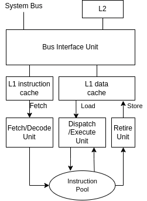

### 8080

- Není x86

### 8086

- Prvním 16-bit

### 8088

- Sběrnice zúžená na 8bit
- Jinak stejné jak 8086

### 80186

- Navržen pro embedded (vestavěná) zařízení
- Má [DMA](## "Direct Memory Access")
- Vyráběn 25 let

### 80286

- Lze přepnout do Protected modu (4 úrovně oprávnění)
- Real mode (pro zpětnou kompatibilitu, RM programy nemůžou fungovat v novém PM)
- má [MMU](## "Memory Management Unit")

### 80386dx a sx

- sx je downgrade dx
- První 32bit
- Přidán Virtual Mode (po přepnutí do PM, bylo možnost vykonávat RM programy)

### 8087/287/387

- Matematický koprocesor, pro práci s floaty, který byl zvlášt

### 80486dx (později i sx verze)

- Dvojnásobný výkon při stejné frekvenci, než 386
- L1 přímo v procesoru
- Integrace matematického koprocesoru

### Pentium

- První procesor v řadě x86, kde jsou uplatněna technická řešení typická pro RISC
- L1 rozdělena na kod a data
- Predikce skoků

### Pentium Pro

- ZÁSADNÍ technologický zlom
- Pro servery ($\Rarr$ velký výkon (zhruba o 50% víc než pentium) a cena)
- L2 přímo na procesoru
- Fetch/Decode jednotka dekoduje x86 instrukce na 118bit RISC instrukce (které intel pojmenoval jako mikro-operace)
- Instrukce jsou po dekodování uloženy do [banky instrukcí](## "Instruction pool"), vejde se tam až 40 instrukcí
- Dispatch/Execute jednotka si může vybírat instrukce mimo pořadí z poolu (Out of order execute)
- 10ti úrovňové zřetězení
- Predikce skoků si pamatuje 512 hodnot

### Pentium 2

- Vychází z Pentia Pro

### Pentium 3

- Optimalizace z hlediska spotřeby
- Dobré pro přenosné počítače

### Pentium 4

- Mikroarchitektura NetBurst
- Při stejné frekvenci jako P3 měl stejný výkon+-, ale více se zahříval
- 20 úrovňové zřetězení

### Pentium EM64T

- Extended Memory 64 Technology (Později jen Intel64)
- První 64bit procesor
- 30 úrovňové zřetězení
- Velice se přehřívaly 

### Pentium M

- Určeny pro přenosné počítače
- Výkonný procesor s nízkou spotřebou energie
- Obdobný výkon jako P4 při nižší frekvenci a třetinové spotřebě

### Core

### Core 2

### Atom

Následovník, obrázek ???