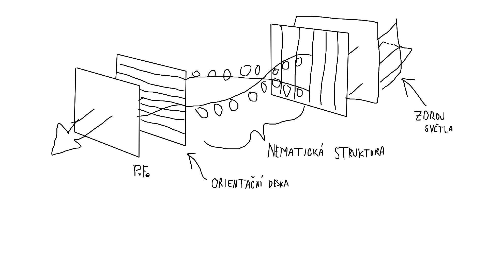
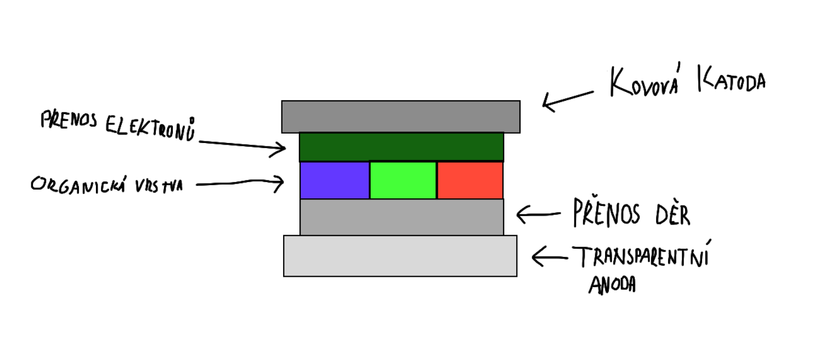
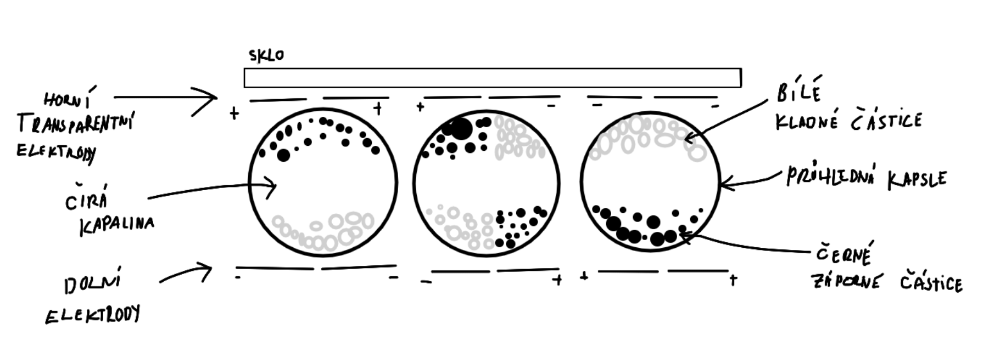

### Jak funguje CRT ???

### Na jakých principech fungují LCD monitory?
- Liquid crystal display
- Každý pixel se skládá z 3 sub pixelů
- Jádrem LCD je TN (twisted nematic) struktura, která je z obou stran obklopena polarizačními vrstvami
- Princip (TN):
    - Světlo projde prvním filtrem a polarizuje se
    - Projde vrstvami pootočených tekutých krystalů, které světlo otočí o 90stupnu
    - Světlo projde i druhým polarizačním filtrem, které je otočeno o 90stupnu proti prvnímu
    - (TN-LCD, které v klidovém stavu bez přivedeného napětí propouští světlo)
    - Po přivedení napětí nématická struktura přestane otáčet světlo, a druhý polarizační filtr ho nepustí

(tady světlo otáčí == pixely jsou zaplé)

- 2 typy:
    - TN - v klidovém stavu svítí
    - IPS - v klidovém stavu nesvítí

### Jaké jsou základní výhody a nevýhody LCD monitorů?
- Výhody:
    - Kvalita obrazu
    - Životnost 
    - Spotřeba energie
    - Odrazivost
    - Bez emisí
- Nevýhody:
    - Citlivost na teplotu
    - Pevné rozlišení
    - Vadné pixely
    - Doba odezvy
    - Není úplně černý, kvůli podsvícení

### Jak fungují OLED zobrazovací jednotky?
- Organic Light Emmiting Diode

- Při přivedení napětí, se elektrony(záporné částice) začnou hromadit v organické vrstvě, blíže k anodě
- Díry (kladné částice) se hromadí na opačné straně blíže katodě
- V organické vrstvě začne docházet ke srážkám a vzájemnou eliminací vzniká světlo

### Jaké jsou výhody a nevýhody OLED technologie?
- Výhody:
    - Jsou samy o sobě zdrojem světla.. nepotřebují podsvícení
    - Vysoký kontrast
    - Tenké
    - Nízka spotřeba
    - Dobrý pozorovací úhel
    - Možnost instalace na pružný podklad
- Nevýhody:
    - Vyšší cena
    - Většinou malé displaye pro mobilní zařízení
    - Degradace materiálu (organického)

### Jak funguje zobrazovací jednotka s technologií E-Ink?
- Elektřina je potřeba jen pro refresh (malý proud, 5-15V)
- V čiré kapalině jsou jen dvě barvy, můzou tvořit gradient, pomocí rozdělení elektrod
- Horní elektrody musí být průsvitné
- Princip:
    - V průhledných kapslích jsou obsaženy kladné a záporné částice různých barev (většinou černá a bílá)
    - Po přivedení napětí se částice v čirém roztoku podle svého náboje přitáhnou k elektrodě opačné polarity
    - Přes průhlednou horní elektrodu jde vidět barva 

### Jaké jsou výhody a nevýhody E-Ink?
- Výhody:
    - Vysoké rozlišení
    - Dobrá čitelnost
    - Není potřeba podsvícení
    - Nulová spotřeba při zobrazování statické informace
    - Nízká spotřeba při překreslení
    - Tenké
- Nevýhody:
    - Dlouhý refresh (100+ms)
    - Málo odstínu šedi
    - Špatné barevné rozlišení

### Jak je u E-Ink řešena podpora více barevných úrovní?
- Rozdělením elektrod 
- V případě barev:
    - Stejně jako u LCD => barevné filtry
    - Nad každou kapslí je jeden barevný filtr z trojce RGB
    - Špatné barvy.. barevá hloubka je 4096

