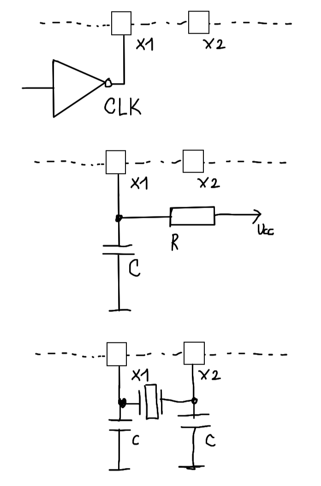
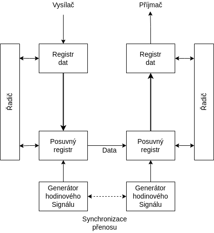
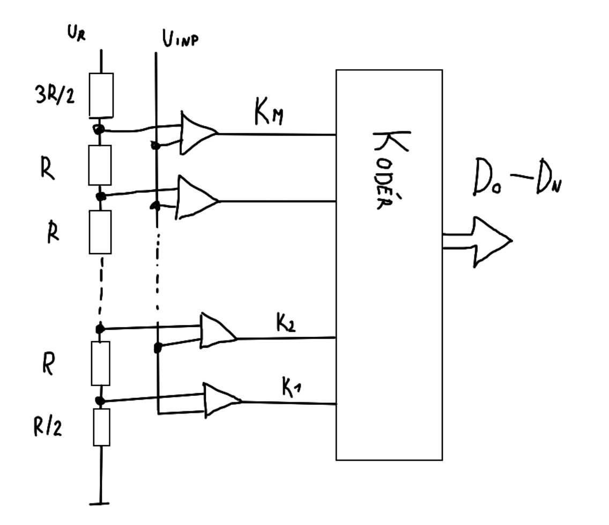
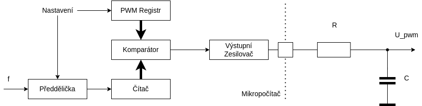

- Monolit = Procesor, Paměť, Periferie v jednom pouzdře
- Používá se převážně Hardvardská architektura
- Kvůli jednoduchosti bývají převážně RISC

### Jaká je obvyklá organizace pamětí v mikropočítačích?
- Střádačové (pracovní registry)
    - Většinou jen jeden, nebo dva
    - Ukládájí se do nich aktuálně zpracovávaná data
- Univerzální zápisníkové registry
    - Pro nejčastěji používaná data
- Paměť dat RWM
    - Pro rozsáhlejší a méně používaná data
- Speciální - např. IP
- Zásobník pro návratové adresy (nutnost mít stack pointer)

### Jaké zdroje hodinového signálu se mikropočítačích používají?
- (Zdroj synchronizace)
- Často je zdroj integrován přímo v počítači - nelze zajistit dobrou stabilitu (Vlivem teplot můžou být odchylky kmitočtu desítky %)
- Generátory:
    - Krystal (Dobrý pro stabilitu)
    - Keramický rezonátor
    - Obvod LC
    - Obvod RC (Pro minimalizaci ceny)
    - Externí zdroj

### Jak probíhá RESET mikropočítače?
- Počáteční stav počítače
- Po provedení RESETu se u všech počítačů nastaví počáteční hodnota čítače instrukcí (0 nebo samé 1)
- Výrobce definuje jako dlouho RESET signál trvá
- Zdroj signálu může být vnější nebo vnitřní

### Jakými způsoby se řeší ochrana proti rušení v mikropočítačích?
- Mechanická ochrana - musí odolávat nárazům, nebo trvalým vibracím
- Galvanické oddělení - proti elektromagnetickým vlivům
- WATCHDOG - aby nám program nezabloudil 
- Větším rozsahem pracovního napětí

### Jaké jsou základní vlastnosti V/V bran?
- Nejčastější a nejjednodušší je `Paralelní brána - port`
    - Obvykle organizovaná jako skupina 4 nebo 8 jednobit vývodů

### Popište obecný princip fungování sériových rozhraní? Jaká sériová rozhraní znáte?
- Dovoluje efektivním způsobem přenášet data na relativně velké vzdálenosti při použití minimálního počtu vodičů
- Je to celkem pomalá komunikace
- Dle vzdálenosti přenosu dělíme na:
    - Mezi elektronickými zařízeními (na delší vzdálenost)
        - Synchroní nebo asynchroní přenos
        - Typicky pomocí RS232 nebo RS485
    - Uvnitř el. zařízení
        - Typickým standardem je I2C 
- Princip ???

### K čemu slouží v mikropočítačích čítače a časovače? Jak fungují?
- Čítač je registr o N bitech, který nejčastěji čítá vnější události
    - Při přetečení se obvykle automaticky předává výzva do přerušovacího podsystému.
- Časovač je podobný jako čítač, ale je inkrementován vnitřním hodinovým signálem 
    - Zajišťuje řízení událostí v realném čase

### Popište konstrukci a fungování základních A/D převodníků.
- Převádí Analogový signál na Digitální
    - Komparační A/D převodník
        - Porovnává měřené veličiny s referenční hodnotou
        - Rychlé
        - S počtem komparátorů roste rozlišovací schopnost

        

    - A/D převodník s D/A převodem
        - pro sledování pomalu rostoucích veličin
        - Používá se jeden komparátor a proměnný zdroj referenční hodnoty
        - Sledovací
            - Mění vždy referenční hodnotu o krok nahoru nebo dolů
        - Aproximační
            - Půlení intervalu
    - Integrační A/D převodník
        - Metoda dvojité integrace
    - Převodník s časovacím RC článkem
        - Měří se doba nabití a vybití kondenzátoru

### Popište konstrukci a fungování základních D/A převodníků.
- Převádí digitální signál na analogový
- [PWM](## "Pulse Width Modulation")
    - Převodníky mají velké zpoždění
    - Pro převod slouží RC článek
    - Hodnota Analog. signálu je "zakódována" jako poměr mezi stavy vypnuto a zapnuto
- Paralelní převodníky
    - Přímý převod číselné hodnoty na stejnosměrný proud
    - Základem je většinou odporová síť
    - Typy:
        - Váhově řazené hodnoty odporů (1:2:4:8..64:128) (náročné dodržet poměr kvůli přesnosti odporů)
        - R-2R

### NÁKRES D/A ?

### Jaké speciální periferie mikropočítačů znáte?
- Řízení dobíjení baterií
- Vysílače a příjmače IR signálu
- USB rozhraní typu klient
- Řadiče LCD a LED