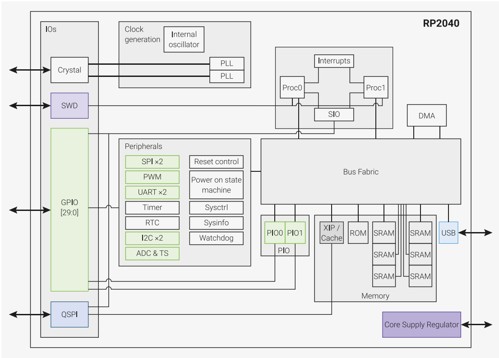
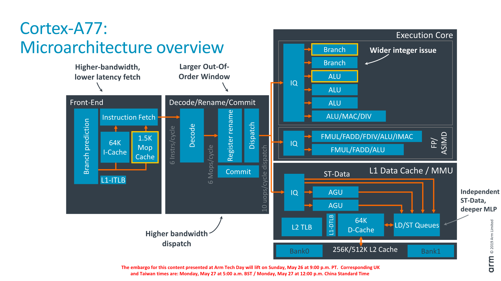
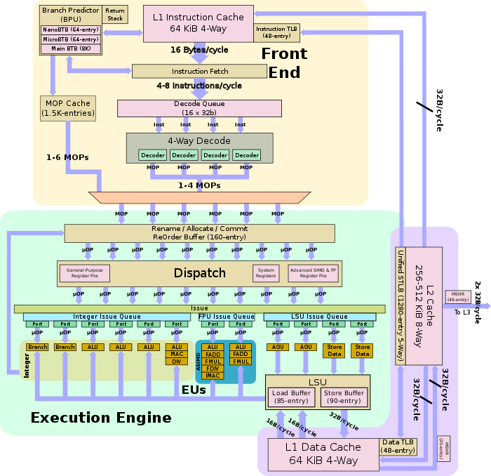
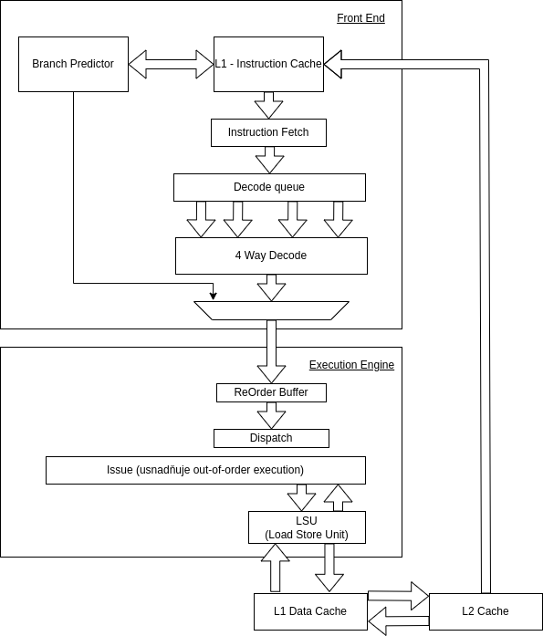
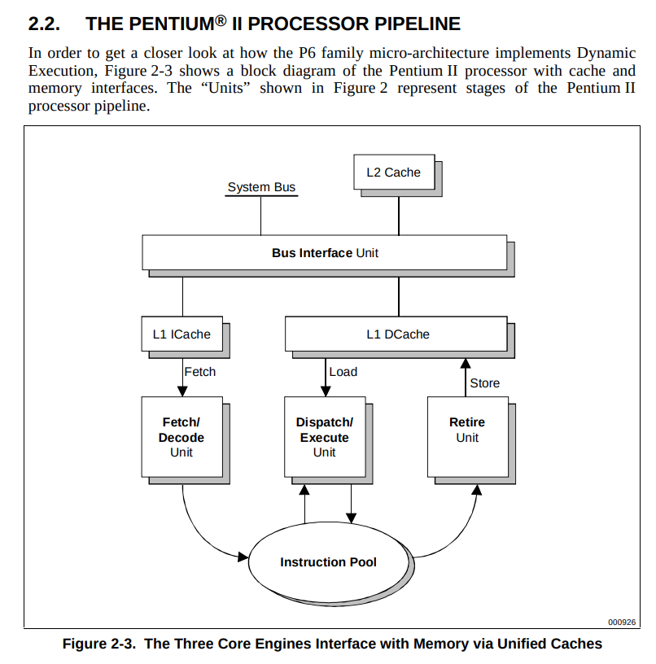

### RP2040

- Levný mikrokontroler (kolem 50kč), používaný v R Picu, vydán v lednu 2021
- 2 jádra ARM Cortex M0+ až 133MHz
- 264kB SRAM (rozdělena do 6 banek)
- 16MB flash paměti
- DMA controller
- Periferie:
    - 2x UART controller
    - 2x SPI controller
    - 2x I2C controller
    - PWM conroller
    - Watchdog
    - RTC

### ARM Cortex A-77
- nad 3GHz
- ARMv8-A architektura (instrukční sada) - Harvard
- 64bit
- Vydán v roce 2019
- 13-ti úrovňové zřetězení
- 8 Jader
- L1, L2 a L3 cache
- FPU
- Out of Order Zpracování instrukcí
- Primárně v mobilech s androidem => nízká spotřeba
- [TODO: přečíst](https://www.cnews.cz/arm-cortex-a77cpu-jadro-architektura-velky-narust-vykonu-ipc/)

https://en.wikichip.org/wiki/arm_holdings/microarchitectures/cortex-a77

### Následovník Pentia Pro ?

Ano.. vypadá stejně jak Pentium Pro.. ale má navíc MMX jednotku (SIMD instrukce), větší frekvenci a o polovinu menší frekvenci L2 cache

[Strana 21](https://www.lpthe.jussieu.fr/~talon/pentiumII.pdf)